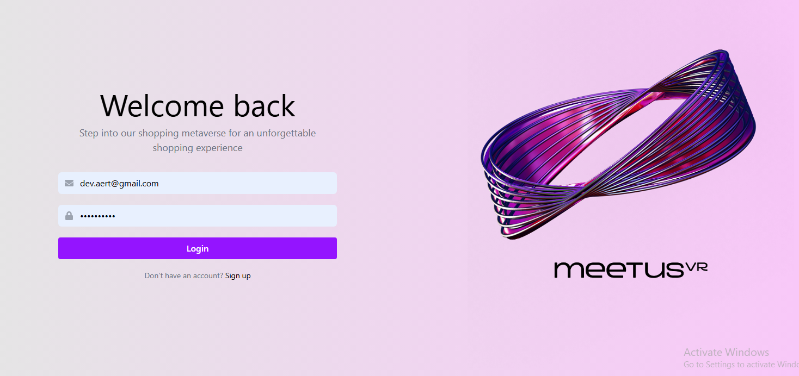
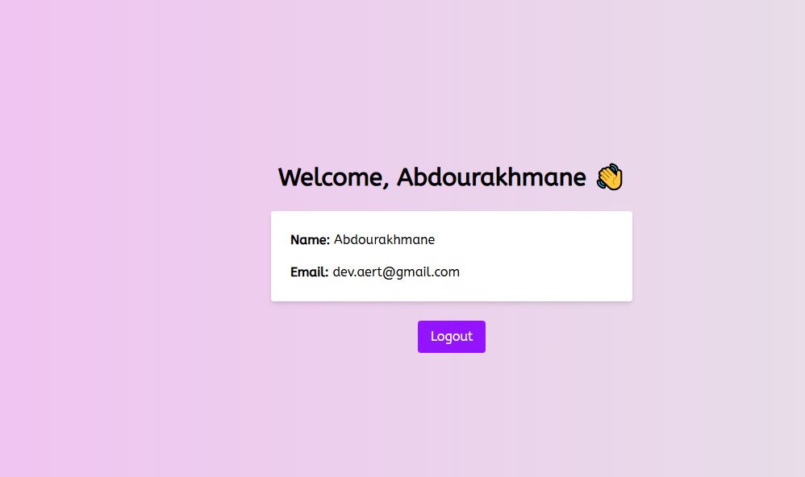

# React + Vite

This template provides a minimal setup to get React working in Vite with HMR and some ESLint rules.

Currently, two official plugins are available:

- [@vitejs/plugin-react](https://github.com/vitejs/vite-plugin-react/blob/main/packages/plugin-react) uses [Babel](https://babeljs.io/) for Fast Refresh
- [@vitejs/plugin-react-swc](https://github.com/vitejs/vite-plugin-react/blob/main/packages/plugin-react-swc) uses [SWC](https://swc.rs/) for Fast Refresh

## Expanding the ESLint configuration

If you are developing a production application, we recommend using TypeScript with type-aware lint rules enabled. Check out the [TS template](https://github.com/vitejs/vite/tree/main/packages/create-vite/template-react-ts) for information on how to integrate TypeScript and [`typescript-eslint`](https://typescript-eslint.io) in your project.

<!-- ********************************************************* -->

# Yeshtery Login Assessment ✅

This is a React + Vite + Tailwind app for Yeshtery's developer login challenge.

## 🔧 Tech Stack

- React
- Vite
- TailwindCSS
- Zustand (state management)
- Axios
- React Toastify
- React Router

## 🧪 Local Setup

```bash
# 1. Clone the repo
git clone https://github.com/your-username/yeshtery-login-assessment.git

# 2. Install dependencies
cd yeshtery-login-assessment
npm install

# 3. Start dev server
npm run dev


## 🔐 Test Credentials

```env
Email: dev.aert@gmail.com  
Password: helloworld


---

## 📷 Screenshots
login.PNG
dashbord.PNG

### 🟢 Login Page


### 🟢 Dashboard Page



```md
## ✅ Completed Tasks Checklist

- [x] تصميم مطابق للـ Figma
- [x] Login بفلترة وValidation
- [x] API للـ Login وجلب بيانات المستخدم
- [x] استخدام Zustand
- [x] Toast للنجاح أو الخطأ
- [x] Responsive UI
- [x] Logout واضح


## 🌐 Live Demo

🔗 https://your-vercel-link.vercel.app
